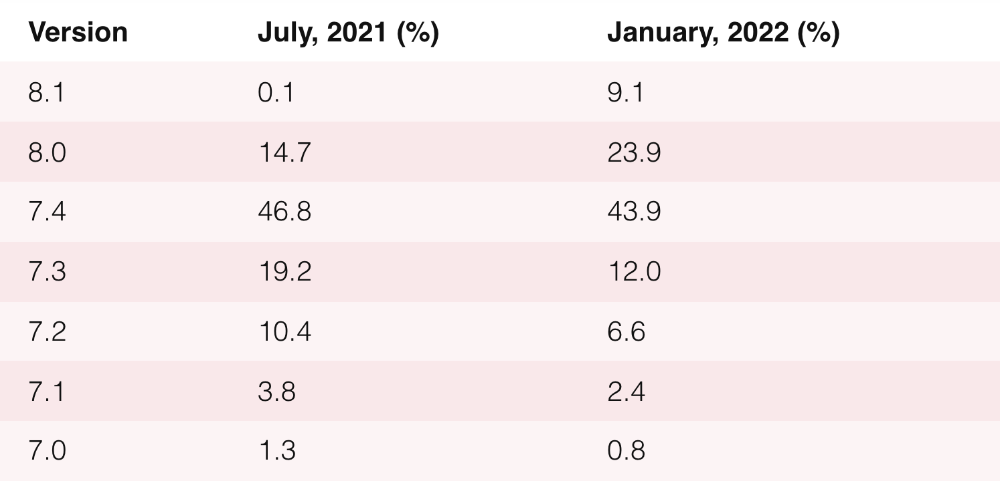

# PHP Annotated - 2022年1月

大家好：

通过特别策划的新闻、文章、工具和视频，了解 PHP 世界的最新消息。

## 新闻

- [PHP 基金会 2022 年 1 月更新](https://opencollective.com/phpfoundation/updates/the-php-foundation-update)

    [PHP 基金会](https://opencollective.com/phpfoundation)作为一个非盈利组织，于 11 月底开始工作，其使命是确保 PHP 语言的存续和繁荣。

    我们已经有了初步结果，来自核心开发者的赞助申请已收到并处理中。

    基金会团队会每个月发布更新，因此您可以订阅我们的推特 [@thephpf](https://twitter.com/thephpf) 以了解最新消息。

    要了解有关 PHP 基金会的更多信息，请查看与 Joe Watkins，Sara Golemon，Sebastian Bergmann 的 [ElePHPant Ep 366 播客的录音](https://voicesoftheelephpant.com/2021/12/17/interview-with-the-php-foundation/)。

- [PHP 8.0.15](https://www.php.net/ChangeLog-8.php#8.0.15)，[PHP 8.1.2](https://www.php.net/ChangeLog-8.php#8.1.2)，[PHP 7.4.27](https://www.php.net/ChangeLog-7.php#7.4.27)

    当前 PHP 分支的 bug 修复已发布。对于 PHP 7.4，这是最后一个常规版本，从现在开始，只会为 PHP 7.4 分支发布安全更新。

- PHP 版本统计：2022 年 1 月

    以下是根据 packagist.org 新提供的 PHP 版本统计，PHP 8.1 在两个月前发布，但已经获得了 9.1% 的份额，但是，还有很多是 PHP 7.4。

    

- [[RFC] 用户定义操作符重载](https://wiki.php.net/rfc/user_defined_operator_overloads#vote)

    在 PHP 中添加运算符重载的提案没有通过投票。但是可以通过收听作者是 Jordan LeDoux 的 [PHP 内部新闻](https://phpinternals.news/96)播客以了解具体信息。Jordan 还公布了[*如何为 PHP 发起 RFC*](https://www.reddit.com/r/PHP/comments/s0pv1e/how_to_make_an_rfc_for_php/) 的详细说明。

    同时，由于 [lisachenko/z-engine](https://github.com/lisachenko/z-engine) 和 FFI，运算符重载已经可以在 PHP 中使用。有关 matrices 运算符的实现示例，请参考：[lisachenko/native-php-matrix](https://github.com/lisachenko/native-php-matrix)。

## 发行

- [thephpleague/flysystem 3.0.0](https://github.com/thephpleague/flysystem) —— 处理文件系统的流行库重大更新。查看[博客文章](https://blog.frankdejonge.nl/flysystem-3-0-0-is-released/)获取所有的详细信息。
- [Cycle 2.0](https://spiralscout.com/blog/meet-cycle-2-0) —— Cycle 的第二个主要版本，PHP 的 DataMapper 和 ORM，可用于传统和后台允许的 PHP 应用程序。
- [ankitpokhrel/tus-php 1.0](https://github.com/ankitpokhrel/tus-php) —— tus.io 的服务器端和客户端实现，用于更新文件上传的开放协议。例如，该协议用于 Vimeo 和 Cloudflare。
- [Infection PHP 0.26.0](https://infection.github.io/2022/01/10/whats-new-in-0.26.0/) —— PHP 变异测试框架更新。新版本添加了 HTML 报告，仅更改字符串的突变等等。
- [Doctrine ORM 2.11](https://www.doctrine-project.org/2022/01/11/orm-2.11.html) —— 本次更新带来了对枚举、虚拟列、只读属性、嵌套属性等等的支持。
- [Roave/BetterReflection 5.0](https://github.com/Roave/BetterReflection/releases/tag/5.0.0) —— 反射 API 改进：可以在不加载类、闭包等的情况下获取信息。新版本新增了对 PHP 8.1 的支持，性能更好。

## 工具

- [viewi/viewi](https://github.com/viewi/viewi) —— 仅使用 PHP 和 HTML 创建主动响应应用程序的强大工具。本质上，它是一个服务器端模板引擎和前端框架。但最令人兴奋的是，该工具会将在 PHP 中编写的所有组件和逻辑编译成原生 JS。

    项目网站 viewi.net 详细介绍了[运行机制](https://viewi.net/docs/introduction#whatisviewi)并有代码示例。可以按照[循序渐进的教程](https://github.com/ivanvoitovych/tour-of-heroes)查看 [Symfony 集成](https://viewi.net/docs/integrations-symfony)。

- [Roach PHP](https://roach-php.dev/) —— 受 Python 流行库 Scrapy 启发的网页抓取工具。
- [symfony/html-sanitizer](https://github.com/symfony/html-sanitizer) —— 新组件，清理不受信任的 HTML 以防范 XSS。它可能是很好的 [HTML Purifier](https://github.com/ezyang/htmlpurifier) 替代品。
- [EventSaucePHP/ObjectHydrator](https://github.com/EventSaucePHP/ObjectHydrator) —— 用于将原始数据（例如 JSON）转化为对象。
- [ajthinking/archetype](https://github.com/ajthinking/archetype) —— 一个用于修改 PHP 文件/类的简单接口。
- [framjet/php-enum-bitmask](https://github.com/framjet/php-enum-bitmask) —— 使用 PHP 8.1 中的枚举作为位掩码。
- [beyondcode/httpdump](https://github.com/beyondcode/httpdump) —— Laravel 应用程序用于调试传入的 HTTP 请求（调试 WEB hook，等等）。随机创建 URL 并以友好的方式将所有请求转储给它们。可以在 httpdump.app 中看到它的运行情况。
- [spatie/ignition](https://github.com/spatie/ignition) 用于显示调试错误页面的库，在 Laravel 中为许多人所熟知，但现在独立于框架，已经更新且可以在任何应用程序中使用。查看[博客文章概述](https://freek.dev/2169-a-better-error-page-for-symfony-applications)。
- [chevere/xr](https://github.com/chevere/xr) —— ReactPHP 的调试服务器，灵感来自 [spatie/ray](https://github.com/spatie/ray)，但它并不是桌面应用程序，它仅仅是一个 CLI 命令，[视频 Demo](https://vimeo.com/662391948)。
- [JustSteveKing/php-sdk](https://github.com/JustSteveKing/php-sdk)，[Sammyjo20/Saloon](https://github.com/Sammyjo20/Saloon) —— 两个相似且具有相同想法的库：simplify SDK creation for services or organize access to different APIs in the common style.
- [AliSaleem27/wordle-cl](https://github.com/AliSaleem27/wordle-cli) —— CLI 版本的流行五字母猜词游戏 Wordle。
- [staabm/phpstan-dba](https://github.com/staabm/phpstan-dba) —— [PHPStan](https://github.com/phpstan/phpstan) 扩展，用于检查 `PDO`、`MySQLi`、`Doctrine/DBAL` 中 SQL 查询的有效性。[Demo](https://github.com/staabm/phpstan-dba/pull/61/files#diff-98a3c43049f6a0c859c0303037d9773534396533d7890bad187d465d390d634e)。
- [flow-php/etl](https://github.com/flow-php/etl) —— An implementation of the Extract Transform Load pattern to use in your PHP application. Check out the [thread](https://twitter.com/norbert_tech/status/1484863793280786439) from the author to learn more.

## Symfony

- **The [symfony-cli](https://github.com/symfony-cli/symfony-cli) tool has been open-sourced**

    In addition to Symfony-specific tasks, the tool includes a local server, which can be used as a modern alternative to MAMP/WAMP. It supports multiple versions of PHP (each project can specify its own), has integration with Docker, local domains, and automatic HTTPS. 

    The tool is implemented in Go, and is available for Linux, macOS, and Windows.

- [A better way to quickly start Symfony projects](https://symfony.com/blog/a-better-way-to-quickly-start-symfony-projects)
- [Introducing the Symfony 6 Certification](https://symfony.com/blog/introducing-the-symfony-6-certification) – 90 minutes for 75 questions from 15 topics.
- [Organizing your Symfony project tests](https://www.strangebuzz.com/en/blog/organizing-your-symfony-project-tests)
- [The key concepts of Symfony’s Security package in 5 minutes](https://alex-daubois.medium.com/symfonys-security-key-concepts-in-5-minutes-e18033c26b35)
- [Symfony Messenger <3 systemd](https://jolicode.com/blog/symfony-messenger-systemd)
- [Use PHP Enums as Doctrine type in Symfony](https://smaine-milianni.medium.com/use-php-enums-as-doctrine-type-in-symfony-85909aa0a19a)
- [Build Symfony and Doctrine ORM Applications with ease using Ecotone](https://blog.ecotone.tech/build-symfony-application-with-ease-using-ecotone/)
- [norberttech/static-content-generator-bundle](https://github.com/norberttech/static-content-generator-bundle) – The tool generates static HTML pages from your Symfony application.
- [Using custom PHP attributes for registering and configuring Symfony Messenger handlers](https://angelovdejan.me/2022/01/09/custom-php-attributes-for-symfony-messenger-handlers.html)
- [JSON Columns and Doctrine DBAL 3 Upgrade](https://dunglas.fr/2022/01/json-columns-and-doctrine-dbal-3-upgrade/)

## Laravel

- [**Laracon Online** is on Feb 9, and it’s free](https://laracon.net/)

    The conference is usually paid, but this Laracon Online Winter will be broadcast free on [YouTube](https://www.youtube.com/watch?v=5ubDLFKKk54).

- [Building a multi-room chat application with Laravel and Centrifugo](https://centrifugal.dev/blog/2021/12/14/laravel-multi-room-chat-tutorial)
- [Managing Laravel services](https://downing.tech/posts/managing-laravel-services)
- [Laravel Pseudo-Daemons](https://aaronfrancis.com/2020/laravel-pseudo-daemons)
- [Primitive Types in Controllers and Closure Routes](https://laravel-news.com/primitive-types-in-controllers-and-closure-routes)
- [How to scale Laravel project on AWS without breaking the bank](https://treblle.com/blog/how-does-treblle-scale-on-aws-without-breaking-the-bank).
- [LaravelDaily/Laravel-Roadmap-Learning-Path](https://github.com/LaravelDaily/Laravel-Roadmap-Learning-Path) – A systematic collection of materials for learning Laravel from simple to complex.
- [Building an API using TDD in Laravel](https://laravel.io/articles/building-and-api-using-tdd-in-laravel)
- [Efficient Pagination Using Deferred Joins](https://aaronfrancis.com/2022/efficient-pagination-using-deferred-joins)
- [45 New Laravel Tips 2022](https://www.youtube.com/watch?v=YzBGmdnGtbY)

## Yii

- [Yii 1.1.25](https://www.yiiframework.com/news/419/yii-1-1-25-is-released) – The first version of the Yii framework is not actively developed, but compatibility fixes are still coming out. This update fixes a few for PHP 8.0.
- The first stable releases for some Yii 3 components have also been released: [yiisoft/user](https://github.com/yiisoft/user), [yiisoft/translator-extractor](https://github.com/yiisoft/translator-extractor), [yiisoft/config](https://github.com/yiisoft/config), [yiisoft/yii-swagger](https://github.com/yiisoft/yii-swagger), [yiisoft/widget](https://github.com/yiisoft/widget), [yiisoft/router](https://github.com/yiisoft/router).
- [Yii news 2021, issue 4](https://opencollective.com/yiisoft/updates/yii-news-2021-issue-4)

## 杂项

- [7年后尝试 PHP](https://www.kode-krunch.com/2021/12/trying-out-php-after-7-years.html) of working with Java.
- [2022 年的 PHP ](https://stitcher.io/blog/php-in-2022) – Brent Roose’s traditional ecosystem overview.
- [PHP 解释 Heap](https://doeken.org/blog/heaps-explained-in-php)
- [PHP 责任链设计模式实现](https://orangesoft.co/blog/chain-of-responsibility-design-pattern-in-php)
- [async & await at the edge with ReactPHP](https://blog.wyrihaximus.net/2021/12/async-and-await-at-the-edge-with-reactphp/) – PHP 8.1 with fibers support is out! One of the ReactPHP maintainers writes about how they’re used. In particular, the new `React\Async\async` and `React\Async\await` functions have been added.
- [PHP 基准测试：include() 与 file_get_contents()](https://konstantin.blog/2021/php-benchmark-include-vs-file_get_contents/) – `include()` can be faster than `file_get_contents()` if you tweak the Opcache settings.
- [Where does my validation live?](https://blog.frankdejonge.nl/where-does-validation-live/)
- [How to build maintainable PHP applications](https://blog.ecotone.tech/how-to-build-maintainable-php-applications/) and decouple business logic from the frameworks.
- [理解 PHP 的 8 个日志级别](https://darkghosthunter.medium.com/php-making-sense-of-the-8-log-levels-ddd27c4719a) – You’ll most likely only need four.
- [覆盖 vendor 类](https://downing.tech/posts/overriding-vendor-classes) – If you don’t want to create a fork, you could properly configure autoloading in composer.json. Or as an option, you can also use patches with [cweagans/composer-patches](https://github.com/cweagans/composer-patches).
- [在 PHP 中访问私有属性](https://www.lambda-out-loud.com/posts/accessing-private-properties-php/) – Instead of reflection and access through `Closure::bind` you can cast object to array (but should you?).
- Sometimes it can be useful to look at the generated opcodes to understand what is going on in the code. The command `phpdbg -p* file.php will help.

    <iframe src="https://twitter.com/AllaertPatrick/status/1478323931924860928?s=20">

## 社区

- <iframe width="560" height="315" src="https://www.youtube.com/embed/IfcFQxYPTxo" title="YouTube video player" frameborder="0" allow="accelerometer; autoplay; clipboard-write; encrypted-media; gyroscope; picture-in-picture" allowfullscreen></iframe>